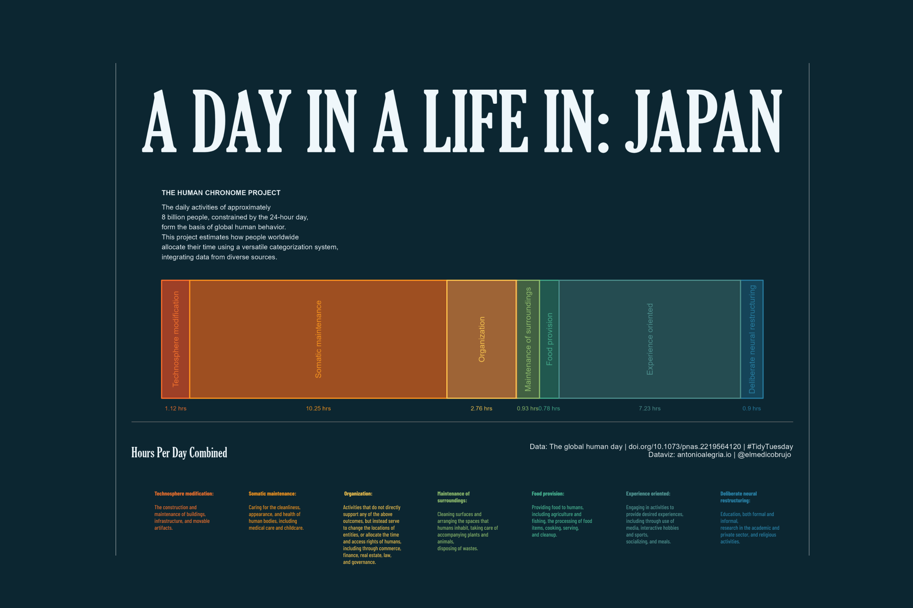
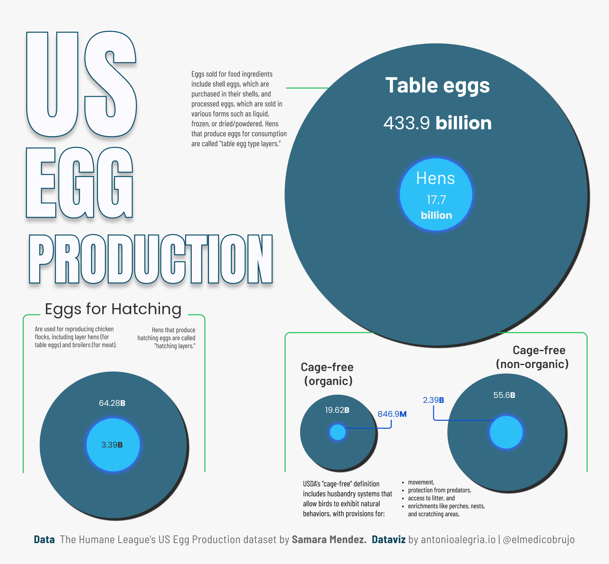
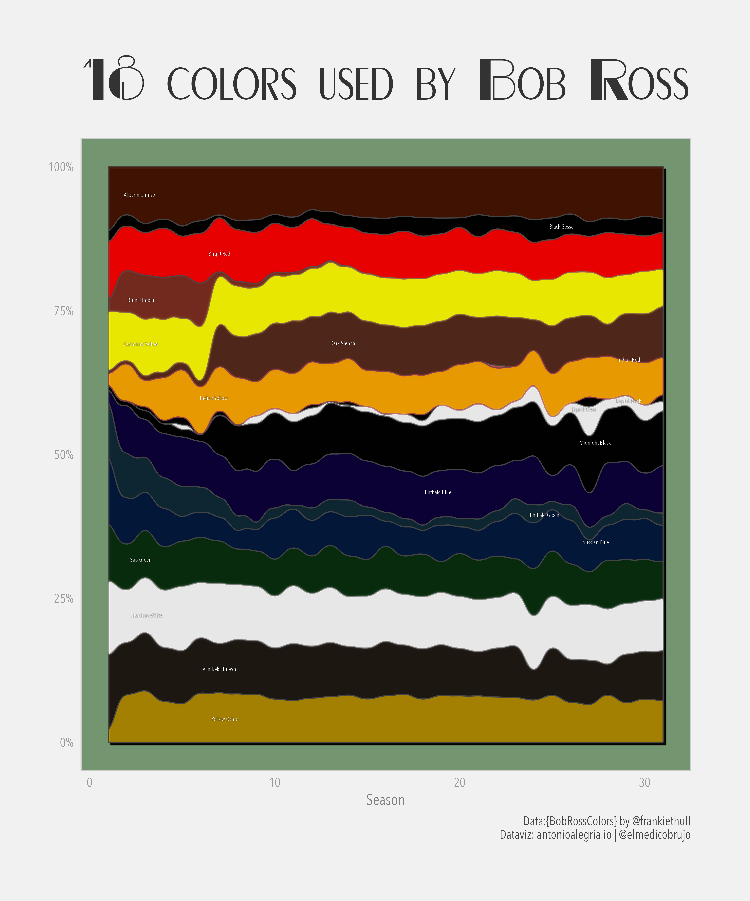
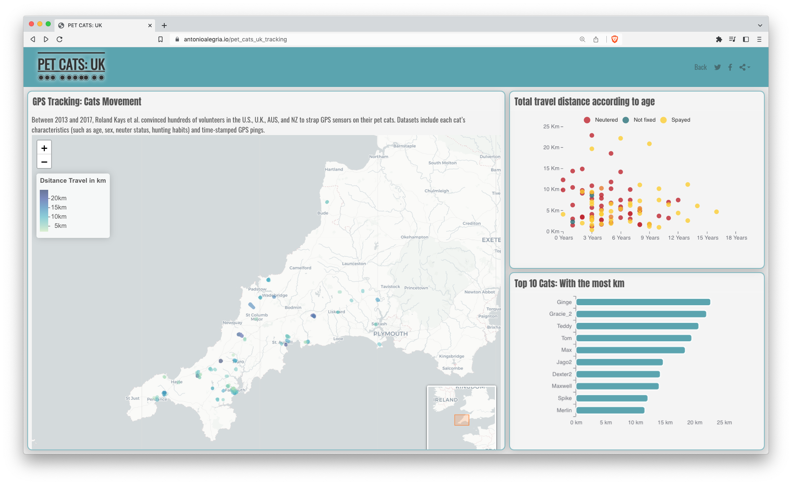
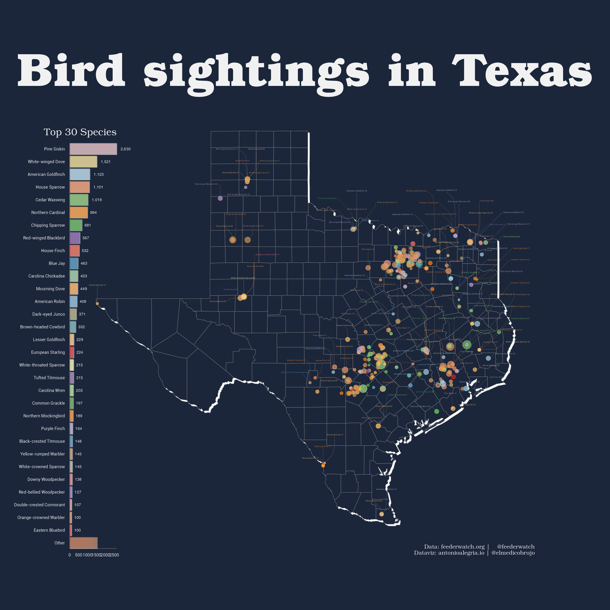
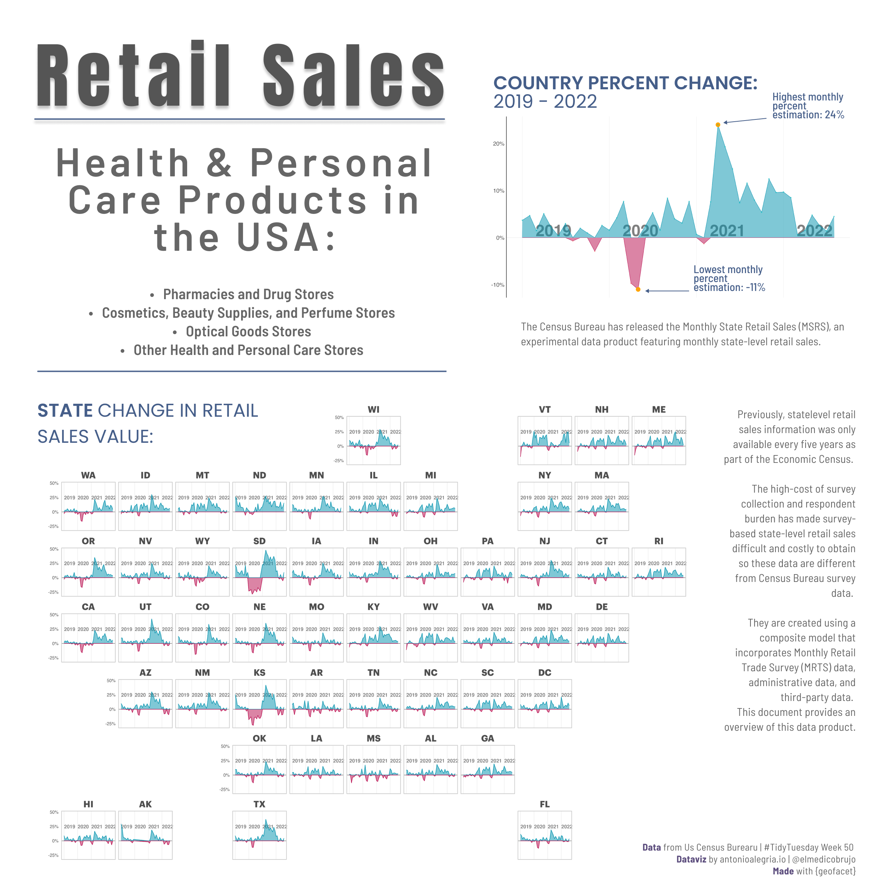

# TidyTuesdayRepository

Code Dump of all personal contributions to the #TidyTuesday. A weekly social data project in R

You can Join the R4DS Online Learning Community in the weekly  [#TidyTuesday](https://github.com/rfordatascience/tidytuesday)

Questions, criticism, and opinions are more than welcome. 🧉

## 2023 Contributions

## 2023-10-10

>Halloween is coming soon, so we're exploring a spooky dataset: a compilation of Haunted Places in the United States. 
The dataset was [compiled by Tim Renner](https://github.com/timothyrenner/shadowlands-haunted-places), using [The Shadowlands Haunted Places Index](https://www.theshadowlands.net/places/), and [shared on data.world](https://data.world/timothyrenner/haunted-places).

Note: Labels were made in Figma.
Another note: HOW ABOUT THAT RAYSHADER SHPERE!!!!!!!!🤯🤯🤯🤯🤯🤯🤯🤯🤯

## 2023-09-12 A day in a life

>The data this week comes from the [The Human Chronome Project](https://www.humanchronome.org/) an initiative based at McGill University in Montreal, from their paper [The global human day in PNAS](https://www.pnas.org/doi/10.1073/pnas.2219564120#sec-2) and the associated dataset on Zenodo.

>The daily activities of ≈8 billion people occupy exactly 24 h per day, placing a strict physical limit on what changes can be achieved in the world. These activities form the basis of human behavior, and because of the global integration of societies and economies, many of these activities interact across national borders. This project estimates how all humans spend their time using a generalized, physical outcome–based categorization that facilitates the integration of data from hundreds of diverse datasets.

## 2023-03-11 US Egg Production

The data this week comes from [The Humane League's US Egg Production](https://thehumaneleague.org/article/E008R01-us-egg-production-data) dataset by [Samara Mendez](https://samaramendez.github.io/)

>In this project, they synthesize an analysis-ready data set that tracks cage-free hens and the supply of cage-free eggs relative to the overall numbers of hens and table eggs in the United States. The data set is based on reports produced by the United States Department of Agriculture (USDA), which are published weekly or monthly. 

## 2023-02-21 Bob Ross Paintings

> The data this week comes from Jared Wilber's data on [Bob Ross Paintings](https://github.com/jwilber/Bob_Ross_Paintings/blob/master/data/bob_ross_paintings.csv) via @frankiethull [{BobRossColors}](https://github.com/frankiethull/BobRossColors) data package.

[R4DS Repo](https://github.com/rfordatascience/tidytuesday/blob/master/data/2023/2023-02-21/readme.md)

## 2023-01-31 Pet Cats UK 🐈 🇬🇧

>Between 2013 and 2017, Roland Kays et al. convinced hundreds of volunteers in the U.S., U.K., Australia, and New Zealand to strap GPS sensors on their pet cats. The aforelinked datasets include each cat’s characteristics (such as age, sex, neuter status, hunting habits) and time-stamped GPS pings.

[R4DS Repo](https://github.com/rfordatascience/tidytuesday/blob/master/data/2023/2023-01-31/readme.md)

[Dashboard Access](https://bit.ly/3Xa6iOf) 

## 2023-01-10 Project FeederWatch 🐦🦉🦅

>FeederWatch is a November-April survey of birds that visit backyards, nature centers, community areas, and other locales in North America. Citizen scientists could birds in areas with plantings, habitat, water, or food that attracts birds. The schedule is completely flexible. People count birds as long as they like on days of their choosing, then enter their counts online. This allows anyone to track what is happening to birds around your home and to contribute to a continental data-set of bird distribution and abundance.

[R4DS Repo](https://github.com/rfordatascience/tidytuesday/blob/master/data/2023/2023-01-10/readme.md)

## 2022 Contributions

## 2022-12-13 Retail Sales 🇺🇸📈
 
> The Monthly State Retail Sales (MSRS) is the Census Bureau's new experimental data product featuring modeled state-level retail sales.

[R4DS Repo](https://github.com/rfordatascience/tidytuesday/tree/master/data/2022/2022-12-13)

